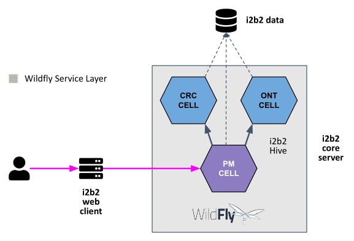

# i2b2-demo

A collection of Docker images preinstalled with [i2b2 software](https://www.i2b2.org/software/index.html) for demonstration purposes.

The following i2b2 software are preinstalled:

- i2b2 Data [Release 1.7.12a](https://github.com/i2b2/i2b2-data/releases/tag/v1.7.12a.0001)
- i2b2 Core Server [Release 1.7.12a](https://github.com/i2b2/i2b2-core-server/releases/tag/v1.7.12a.0002)
- i2b2 Web Client [Release 1.7.12a](https://github.com/i2b2/i2b2-webclient/releases/tag/v1.7.12a.0002)

For documentations on the i2b2 software please visit the [i2b2 Community Wiki](https://community.i2b2.org/wiki/)

<figure>
    
    <figcaption align="center">
        <b>Fig. 1 - i2b2 Web Application Diagram</b>
    </figcaption>
</figure>

## Docker User-defined Bridge Network

The containers run on a user-defined bridge network ***i2b2-demo-net***.  The user-defined bridge network provides better isolation and allows containers on the same network to communicate with each other using their container names instead of their IP addresses.

### Ensure User-defined Bridge Network Exists

To verify that the network ***i2b2-demo-net*** exists, execute the following command to list all of the Docker's networks:

```
docker network ls
```

The output should be similar to this:

```
NETWORK ID     NAME            DRIVER    SCOPE
d86843421945   bridge          bridge    local
58593240ad9d   host            host      local
9a82abc00473   i2b2-demo-net   bridge    local
```

If ***i2b2-demo-net*** network is **not** listed, execute the following command to create it:

```
docker network create i2b2-demo-net
```

## Run the i2b2 Demo

### Prerequisites

- [Docker 19 or above](https://docs.docker.com/get-docker/)

Open up a terminal and execute the following commands to download and run the prebuilt images:

#### Run Demo With PostgreSQL

###### Linux / macOS:

```
docker run -d --name=i2b2-data-demo \
--network i2b2-demo-net \
-e POSTGRESQL_ADMIN_PASSWORD=demouser \
-p 5432:5432 \
kvb2univpitt/i2b2-data-demo-postgresql:v1.7.12a.2022.01

docker run -d --name=i2b2-core-server-demo \
--network i2b2-demo-net \
-p 9090:9090 \
kvb2univpitt/i2b2-core-server-demo-postgresql:v1.7.12a.2022.01

docker run -d \
--name=i2b2-webclient-demo \
--network i2b2-demo-net \
-p 80:80 -p 443:443 \
kvb2univpitt/i2b2-webclient-demo:v1.7.12a.2022.01
```

###### Windows

```
docker run -d --name=i2b2-data-demo ^
--network i2b2-demo-net ^
-e POSTGRESQL_ADMIN_PASSWORD=demouser ^
-p 5432:5432 ^
kvb2univpitt/i2b2-data-demo-postgresql:v1.7.12a.2022.01

docker run -d --name=i2b2-core-server-demo ^
--network i2b2-demo-net ^
-p 9090:9090 ^
kvb2univpitt/i2b2-core-server-demo-postgresql:v1.7.12a.2022.01

docker run -d ^
--name=i2b2-webclient-demo ^
--network i2b2-demo-net ^
-p 80:80 -p 443:443 ^
kvb2univpitt/i2b2-webclient-demo:v1.7.12a.2022.01
```

#### Run Demo With SQL Server

###### Linux / macOS:

```
docker run -d --name=i2b2-data-demo \
--network i2b2-demo-net \
-e MSSQL_AGENT_ENABLED=true \
-e ACCEPT_EULA=Y \
-e SA_PASSWORD=Demouser123! \
-p 1433:1433 \
kvb2univpitt/i2b2-data-demo-sqlserver:v1.7.12a.2022.01

docker run -d --name=i2b2-core-server-demo \
--network i2b2-demo-net \
-p 9090:9090 \
kvb2univpitt/i2b2-core-server-demo-sqlserver:v1.7.12a.2022.01

docker run -d \
--name=i2b2-webclient-demo \
--network i2b2-demo-net \
-p 80:80 -p 443:443 \
kvb2univpitt/i2b2-webclient-demo:v1.7.12a.2022.01
```

###### Windows

```
docker run -d --name=i2b2-data-demo ^
--network i2b2-demo-net ^
-e MSSQL_AGENT_ENABLED=true ^
-e ACCEPT_EULA=Y ^
-e SA_PASSWORD=Demouser123! ^
-p 1433:1433 ^
kvb2univpitt/i2b2-data-demo-sqlserver:v1.7.12a.2022.01

docker run -d --name=i2b2-core-server-demo ^
--network i2b2-demo-net ^
-p 9090:9090 ^
kvb2univpitt/i2b2-core-server-demo-sqlserver:v1.7.12a.2022.01

docker run -d ^
--name=i2b2-webclient-demo ^
--network i2b2-demo-net ^
-p 80:80 -p 443:443 ^
kvb2univpitt/i2b2-webclient-demo:v1.7.12a.2022.01
```

#### Run Demo With Oracle

###### Linux / macOS:

```
docker run -d --name i2b2-data-demo \
--network i2b2-demo-net \
--shm-size="4G" \
-p 1521:1521 -p 5500:5500 \
-e ORACLE_PWD=demouser \
kvb2univpitt/i2b2-data-demo-oracle:v1.7.12a.2022.01

docker run -d --name=i2b2-core-server-demo \
--network i2b2-demo-net \
-p 9090:9090 \
kvb2univpitt/i2b2-core-server-demo-oracle:v1.7.12a.2022.01

docker run -d \
--name=i2b2-webclient-demo \
--network i2b2-demo-net \
-p 80:80 -p 443:443 \
kvb2univpitt/i2b2-webclient-demo:v1.7.12a.2022.01
```

###### Windows

```
docker run -d --name i2b2-data-demo ^
--network i2b2-demo-net ^
--shm-size="4G" ^
-p 1521:1521 -p 5500:5500 ^
-e ORACLE_PWD=demouser ^
kvb2univpitt/i2b2-data-demo-oracle:v1.7.12a.2022.01

docker run -d --name=i2b2-core-server-demo ^
--network i2b2-demo-net ^
-p 9090:9090 ^
kvb2univpitt/i2b2-core-server-demo-oracle:v1.7.12a.2022.01

docker run -d ^
--name=i2b2-webclient-demo ^
--network i2b2-demo-net ^
-p 80:80 -p 443:443 ^
kvb2univpitt/i2b2-webclient-demo:v1.7.12a.2022.01
```

### Access the Web Client

Open up a web browser and go to the URL [https://localhost/webclient/](https://localhost/webclient/).

The browser will show a security warning because the SSL certificates are ***not*** signed and validated by a trusted Certificate Authority (CA).  Click "Accept the Risk and Continue"


The browser will show the login page, as shown below.  Log in with the following credentials:

| Attribute | Value    |
|-----------|----------|
| Username  | demo     |
| Password  | demouser |


Once logged in, the main page will show like the one below:


