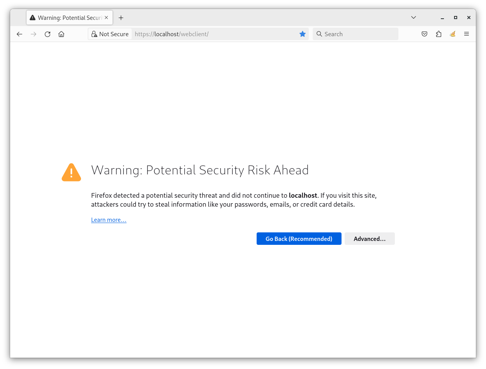
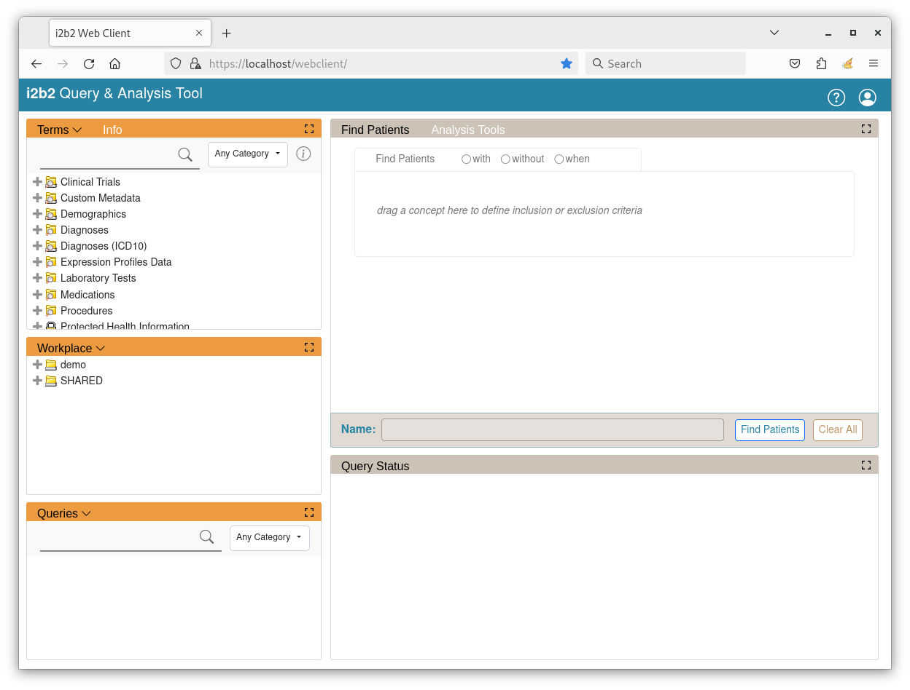
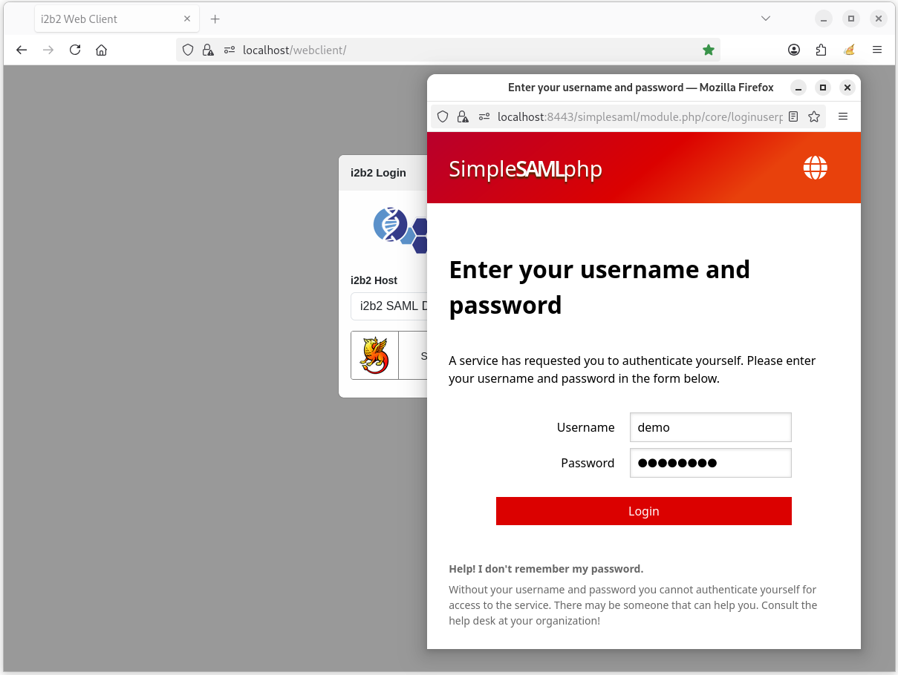
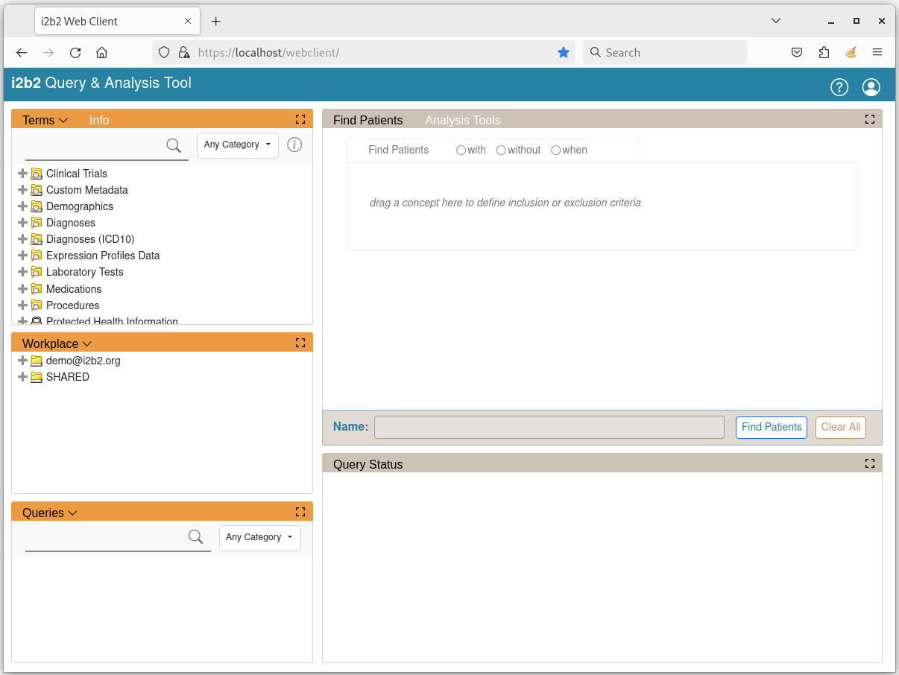

# i2b2-demo

A collection of Docker images preinstalled with [i2b2 software](https://www.i2b2.org/software/index.html) for demonstration purposes.

The following software are preinstalled:

- i2b2 Data [Release 1.8.1](https://github.com/i2b2/i2b2-data/releases/tag/v1.8.1.0001)
- i2b2 Core Server [Release 1.8.1](https://github.com/i2b2/i2b2-core-server/releases/tag/v1.8.1.0001)
- i2b2 Web Client [Release 1.8.1](https://github.com/i2b2/i2b2-webclient/releases/tag/v1.8.1.0001)
- SimpleSAMLphp [Release 1.19.5](https://github.com/simplesamlphp/simplesamlphp/releases/tag/v1.19.5)

## Local and Federated Authentication

The new version of i2b2 (Release 1.8.1) supports federated authentication.  Users can choose to log into the i2b2 webclient using their i2b2 local account (local login) or use their login account from a supported third-party identity provider (federated login).  The i2b2 Docker demo includes both local login and federated login.  SimpleSAMLphp is setup as a demo identity provider (IdP).

<figure>
    
    <figcaption align="center">
        <b>Fig. 1 - i2b2 Webclient Authentication Flow</b>
    </figcaption>
</figure>

## Run the i2b2 Demo

### Prerequisites

- [Docker 19 or above](https://docs.docker.com/get-docker/)

### Prebuilt Docker Container Images

Prebuilt Docker container images have been created demonstration purposes:

- [i2b2-idp-demo](https://hub.docker.com/r/kvb2univpitt/i2b2-idp-demo)
- [i2b2-data-demo](https://hub.docker.com/r/kvb2univpitt/i2b2-data-demo-postgresql)
- [i2b2-core-server-demo](https://hub.docker.com/r/kvb2univpitt/i2b2-core-server-demo-postgresql)
- [i2b2-webclient-demo](https://hub.docker.com/r/kvb2univpitt/i2b2-webclient-demo)
### Docker User-defined Bridge Network

The containers run on a user-defined bridge network ***i2b2-demo-net***.  The user-defined bridge network provides better isolation and allows containers on the same network to communicate with each other using their container names instead of their IP addresses.

#### Ensure User-defined Bridge Network Exists

To verify that the network ***i2b2-demo-net*** exists, execute the following command to list all of the Docker's networks:

```
docker network ls
```

The output should be similar to this:

```
NETWORK ID     NAME            DRIVER    SCOPE
d86843421945   bridge          bridge    local
58593240ad9d   host            host      local
9a82abc00473   i2b2-demo-net   bridge    local
```

If ***i2b2-demo-net*** network is **not** listed, execute the following command to create it:

```
docker network create i2b2-demo-net
```

### Run Demo

Open up a terminal and execute the following commands to download and run the prebuilt Docker container images:

###### Linux / macOS:

```
docker run -d --name=i2b2-idp-demo \
--network i2b2-demo-net \
-p 8080:8080 \
-p 8443:8443 \
-e SIMPLESAMLPHP_ADMIN_PASSWORD=demouser \
kvb2univpitt/i2b2-idp-demo:v1.7.13.2022.06

docker run -d --name=i2b2-data-demo \
--network i2b2-demo-net \
-e POSTGRESQL_ADMIN_PASSWORD=demouser \
-p 5432:5432 \
kvb2univpitt/i2b2-data-demo-postgresql:v1.8.1.2024.06

docker run -d --name=i2b2-core-server-demo \
--network i2b2-demo-net \
-p 9090:9090 \
kvb2univpitt/i2b2-core-server-demo-postgresql:v1.8.1.2024.06

docker run -d \
--name=i2b2-webclient-demo \
--network i2b2-demo-net \
-p 80:80 -p 443:443 \
kvb2univpitt/i2b2-webclient-demo:v1.8.1.2024.06
```

###### Windows

```
docker run -d --name=i2b2-idp-demo ^
--network i2b2-demo-net ^
-p 8080:8080 ^
-p 8443:8443 ^
-e SIMPLESAMLPHP_ADMIN_PASSWORD=demouser ^
kvb2univpitt/i2b2-idp-demo:v1.7.13.2022.06

docker run -d --name=i2b2-data-demo ^
--network i2b2-demo-net ^
-e POSTGRESQL_ADMIN_PASSWORD=demouser ^
-p 5432:5432 ^
kvb2univpitt/i2b2-data-demo-postgresql:v1.8.1.2024.06

docker run -d --name=i2b2-core-server-demo ^
--network i2b2-demo-net ^
-p 9090:9090 ^
kvb2univpitt/i2b2-core-server-demo-postgresql:v1.8.1.2024.06

docker run -d ^
--name=i2b2-webclient-demo ^
--network i2b2-demo-net ^
-p 80:80 -p 443:443 ^
kvb2univpitt/i2b2-webclient-demo:v1.8.1.2024.06
```

### Access the Web Client

Open up a web browser and go to the URL [https://localhost/webclient/](https://localhost/webclient/).

The browser will show a security warning because the SSL certificates are ***not*** signed and validated by a trusted Certificate Authority (CA).  Click "Accept the Risk and Continue"



#### Login with Local Account

By default, local login (Local Demo) is selected, as shown below:


Log in with the following credentials:

| Attribute | Value    |
|-----------|----------|
| Username  | demo     |
| Password  | demouser |

Once logged in, the landing page will appear like the one below:



#### Login with Federated Account

Click on the dropdown box **i2b2 Host** and select ***SAML Demo*** option.  The login dialog will change to federated login as shown below:


Click on the login button ***Sign in with Shibboleth***.  The page will be redircted to **SimpleSAMLphp** login page.  The browser will show a security warning because the SSL certificates are ***not*** signed and validated by a trusted Certificate Authority (CA).


Click "Accept the Risk and Continue" and the SimpleSAMLphp login page will appear.

Log in with the following credentials:

| Attribute | Value    |
|-----------|----------|
| Username  | demo     |
| Password  | demouser |



Once logged in, the landing page will appear like the one below:


