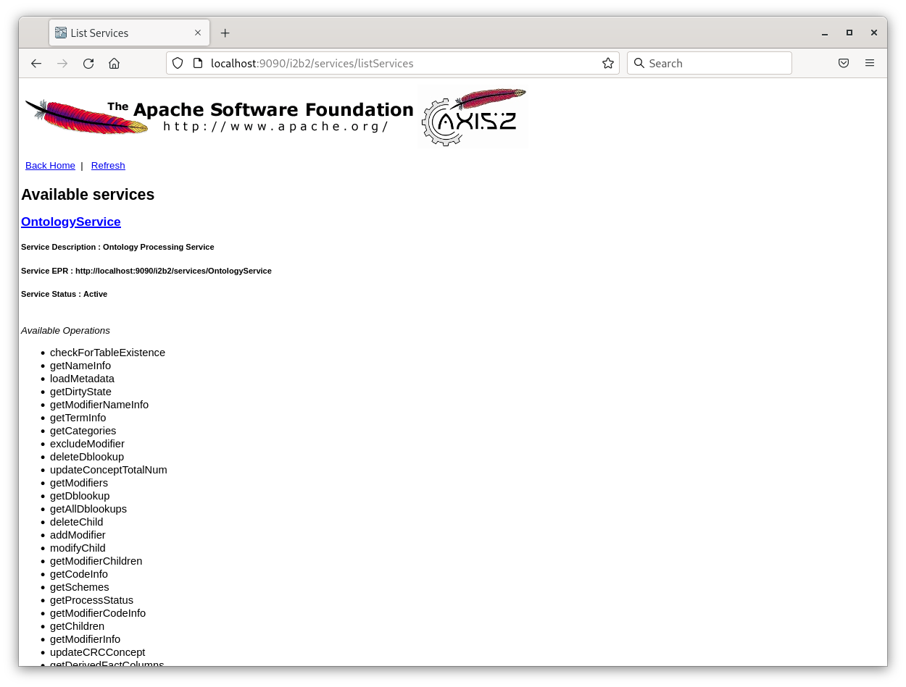

# i2b2-core-server-demo (PostgreSQL)

A Docker image of Wildfly 37.0.1 server running i2b2-core-server ([Release 1.8.2](https://github.com/i2b2/i2b2-core-server/releases/tag/v1.8.2)) connecting to PostgreSQL database.

## Docker User-defined Bridge Network

The container runs on a user-defined bridge network ***i2b2-demo-net***.  The user-defined bridge network provides better isolation and allows containers on the same network to communicate with each other using their container names instead of their IP addresses.

### Ensure User-defined Bridge Network Exists

To verify that the network ***i2b2-demo-net*** exists, execute the following command to list all of the Docker's networks:

```
docker network ls
```

The output should be similar to this:

```
NETWORK ID     NAME            DRIVER    SCOPE
d86843421945   bridge          bridge    local
58593240ad9d   host            host      local
9a82abc00473   i2b2-demo-net   bridge    local
```

If ***i2b2-demo-net*** network is **not** listed, execute the following command to create it:

```
docker network create i2b2-demo-net
```

## Run the Prebuilt Image

A prebuilt Docker image is provided on [Docker Hub](https://hub.docker.com/r/kvb2univpitt/i2b2-core-server-demo-postgresql).

### Prerequisites

- [Docker 28 or above](https://docs.docker.com/get-docker/)

Open up a terminal and execute the following command to download and run the prebuilt image in a container named ***i2b2-core-server-demo***.

###### Linux / macOS:

```
docker run -d --name=i2b2-core-server-demo \
--network i2b2-demo-net \
-e TZ=America/New_York \
-p 9090:9090 \
kvb2univpitt/i2b2-core-server-demo-postgresql:v1.8.2.2025.10
```

###### Windows:

```
docker run -d --name=i2b2-core-server-demo ^
--network i2b2-demo-net ^
-e TZ=America/New_York ^
-p 9090:9090 ^
kvb2univpitt/i2b2-core-server-demo-postgresql:v1.8.2.2025.10
```

### Access Service List

To see the list of all the i2b2 web services, open up a web browser and go to the URL [http://localhost:9090/i2b2/services/listServices](http://localhost:9090/i2b2/services/listServices)



### Docker Container and Image Management

Execute the following to stop the running Docker container:

```
docker stop i2b2-core-server-demo
```

Execute the following to delete the Docker container:

```
docker rm i2b2-core-server-demo
```

Execute the following to delete the Docker image:

```
docker rmi kvb2univpitt/i2b2-core-server-demo-postgresql:v1.8.2.2025.10
```

## Build the Image

### Prerequisites

- [Docker 28 or above](https://docs.docker.com/get-docker/)

### Build the Docker Image:

Open up a terminal in the directory **i2b2-demo/i2b2-core-server-demo/postgresql**, where the ***Dockerfile*** file is, and execute the following command to build the image:

```
docker build -t local/i2b2-core-server-demo-postgresql .
```

To verify that the image has been built, execute the following command to list the Docker images:

```
docker images
```

The output should be similar to the following:

```
REPOSITORY                               TAG          IMAGE ID       CREATED              SIZE
local/i2b2-core-server-demo-postgresql   latest       9b1422eb494f   About a minute ago   891MB
```

### Run the Image In a Container

Execute the following command the run the image in a Docker container name ***i2b2-core-server-demo*** on the user-defined bridge network ***i2b2-demo-net***:

###### Linux / macOS:

```
docker run -d --name=i2b2-core-server-demo \
--network i2b2-demo-net \
-e TZ=America/New_York \
-p 9090:9090 \
local/i2b2-core-server-demo-postgresql
```

###### Windows:

```
docker run -d --name=i2b2-core-server-demo ^
--network i2b2-demo-net ^
-e TZ=America/New_York ^
-p 9090:9090 ^
local/i2b2-core-server-demo-postgresql
```

To verify that the container is running, execute the following command to list the Docker containers:

```
docker ps
```

The output should be similar to the following:

```
CONTAINER ID   IMAGE                                    COMMAND                  CREATED         STATUS         PORTS                                       NAMES
556f8a2abbe8   local/i2b2-core-server-demo-postgresql   "/opt/wildfly-17.0.1…"   5 seconds ago   Up 4 seconds   0.0.0.0:9090->9090/tcp, :::9090->9090/tcp   i2b2-core-server-demo
```

### Docker Container and Image Management

Execute the following to stop the running Docker container:

```
docker stop i2b2-core-server-demo
```

Execute the following to delete the Docker container:

```
docker rm i2b2-core-server-demo
```

Execute the following to delete the Docker image:

```
docker rmi local/i2b2-core-server-demo-postgresql
```
