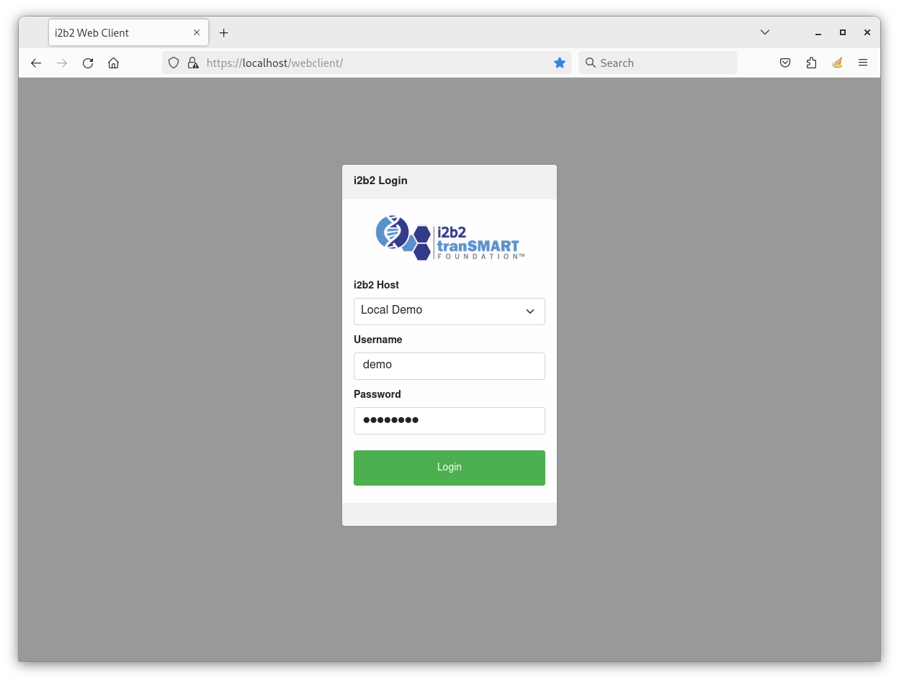
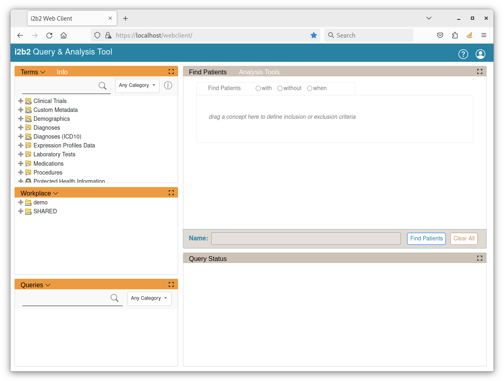

# i2b2-webclient-demo

A Docker image of i2b2 web client ([Release 1.8.0](https://github.com/i2b2/i2b2-webclient/releases/tag/v1.8.0.0002)) for demonstration purposes.

## Docker User-defined Bridge Network

The container runs on a user-defined bridge network ***i2b2-demo-net***.  The user-defined bridge network provides better isolation and allows containers on the same network to communicate with each other using their container names instead of their IP addresses.

### Ensure User-defined Bridge Network Exists

To verify that the network ***i2b2-demo-net*** exists, execute the following command to list all of the Docker's networks:

```
docker network ls
```

The output should be similar to this:

```
NETWORK ID     NAME            DRIVER    SCOPE
d86843421945   bridge          bridge    local
58593240ad9d   host            host      local
9a82abc00473   i2b2-demo-net   bridge    local
```

If ***i2b2-demo-net*** network is **not** listed, execute the following command to create it:

```
docker network create i2b2-demo-net
```

## Run the Prebuilt Image

A prebuilt Docker image is provided on [Docker Hub](https://hub.docker.com/r/kvb2univpitt/i2b2-webclient-demo).

### Prerequisites

- [Docker 19 or above](https://docs.docker.com/get-docker/)

Open up a terminal and execute the following command to download and run the prebuilt image in a container named ***i2b2-webclient-demo***.

###### Linux / macOS:

```
docker run -d \
--name=i2b2-webclient-demo \
--network i2b2-demo-net \
-e TZ=America/New_York \
-p 80:80 -p 443:443 \
kvb2univpitt/i2b2-webclient-demo:v1.8.0.2024.01
```

###### Windows:

```
docker run -d ^
--name=i2b2-webclient-demo ^
--network i2b2-demo-net ^
-e TZ=America/New_York ^
-p 80:80 -p 443:443 ^
kvb2univpitt/i2b2-webclient-demo:v1.8.0.2024.01
```

### Access the Web Client

Open up a web browser and go to the URL [https://localhost/webclient/](https://localhost/webclient/).

The browser will show a security warning because the SSL certificates are ***not*** signed and validated by a trusted Certificate Authority (CA).  Click "Accept the Risk and Continue"


The browser will show the login page, as shown below.  Log in with the following credentials:

| Attribute | Value    |
|-----------|----------|
| Username  | demo     |
| Password  | demouser |



Once logged in, the main page will show like the one below:



### Docker Container and Image Management

Execute the following to stop the running Docker container:

```
docker stop i2b2-webclient-demo
```

Execute the following to delete the Docker container:

```
docker rm i2b2-webclient-demo
```

Execute the following to delete the Docker image:

```
docker rmi kvb2univpitt/i2b2-webclient-demo:v1.8.0.2024.01
```
## Build the Image

### Prerequisites

- [Docker or above](https://docs.docker.com/get-docker/)

### Build the Docker Image:

Open up a terminal in the directory **i2b2-demo/i2b2-webclient-demo**, where the ***Dockerfile*** file is, and execute the following command to build the image:

```
docker build -t local/i2b2-webclient-demo .
```

To verify that the image has been built, execute the following command to list the Docker images:

```
docker images
```

The output should be similar to the following:

```
REPOSITORY                  TAG          IMAGE ID       CREATED          SIZE
local/i2b2-webclient-demo   latest       de79feaaa0ca   43 seconds ago   924MB
kvb2univpitt/centos7-php    v1.2022.01   2d412beb7609   2 weeks ago      875MB
```

### Run the Image In a Container

Execute the following command the run the image in a Docker container name ***i2b2-webclient-demo*** on the user-defined bridge network ***i2b2-demo-net***:

###### Linux / macOS:

```
docker run -d --name=i2b2-webclient-demo \
--network i2b2-demo-net \
-p 80:80 -p 443:443 \
local/i2b2-webclient-demo
```

###### Windows:

```
docker run -d --name=i2b2-webclient-demo ^
--network i2b2-demo-net ^
-p 80:80 -p 443:443 ^
local/i2b2-webclient-demo
```

To verify that the container is running, execute the following command to list the Docker containers:

```
docker ps
```

The output should be similar to the following:

```
CONTAINER ID   IMAGE                       COMMAND                  CREATED         STATUS         PORTS                                                                      NAMES
43b0c8211dd4   local/i2b2-webclient-demo   "/usr/sbin/httpd -D …"   3 seconds ago   Up 2 seconds   0.0.0.0:80->80/tcp, :::80->80/tcp, 0.0.0.0:443->443/tcp, :::443->443/tcp   i2b2-webclient-demo
```

### Docker Container and Image Management

Execute the following to stop the running Docker container:

```
docker stop i2b2-webclient-demo
```

Execute the following to delete the Docker container:

```
docker rm i2b2-webclient-demo
```

Execute the following to delete the Docker image:

```
docker rmi local/i2b2-webclient-demo
```
